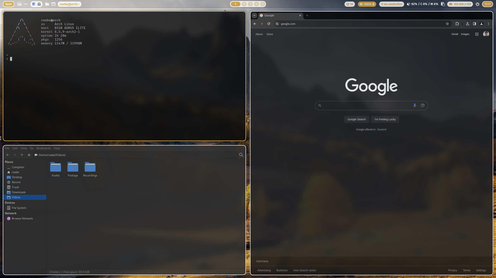
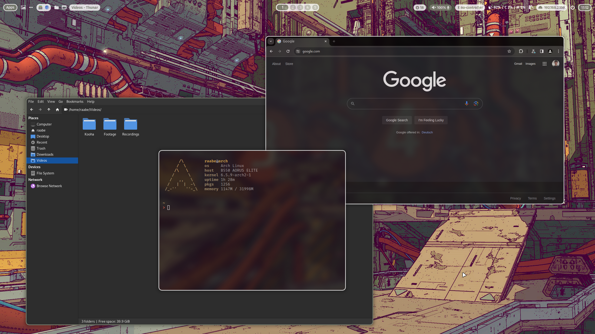
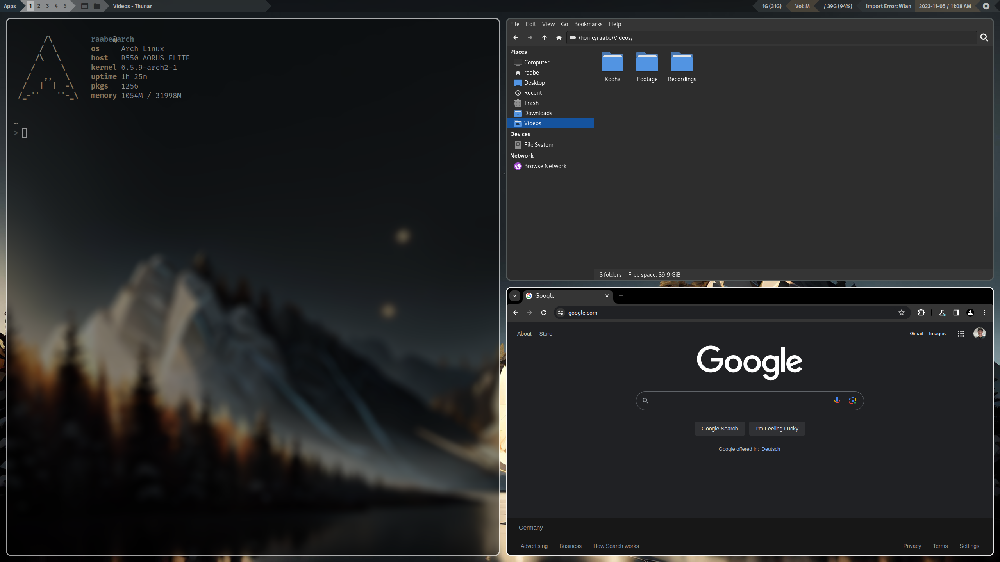
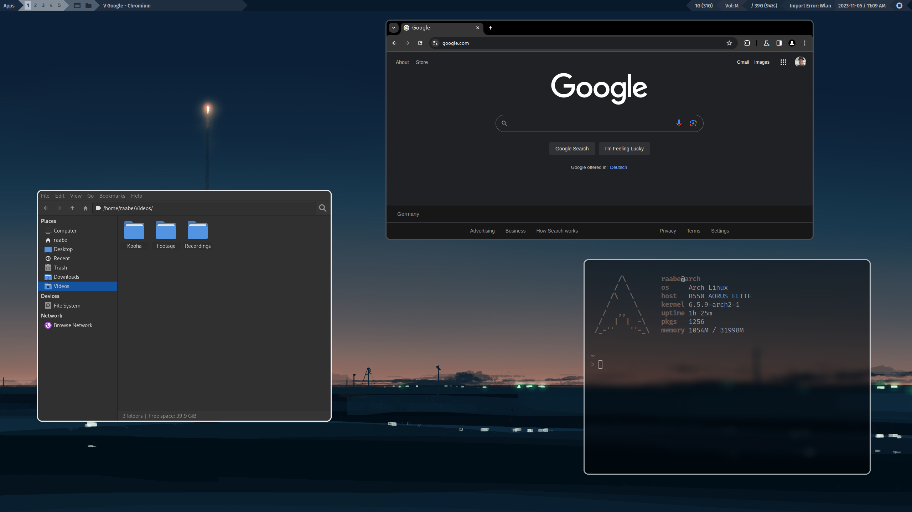
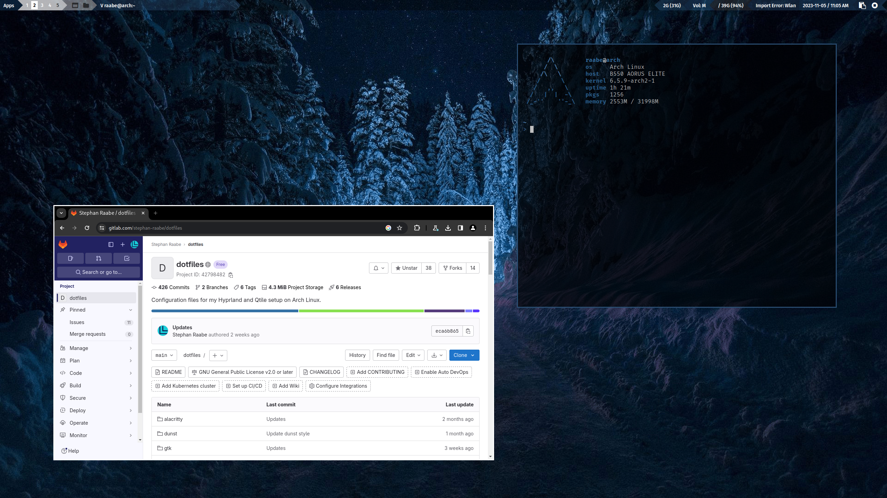
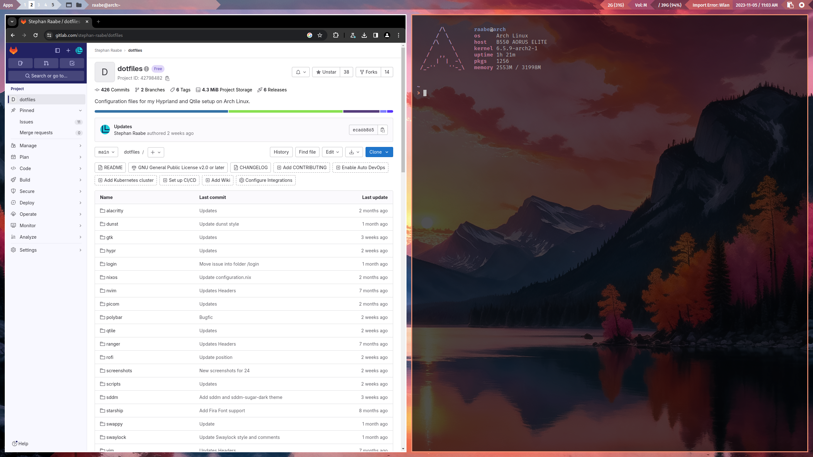

# ML4W dotfiles Version 2.5

This is my configuration of Hyprland (Wayland) and Qtile (Xorg & Wayland).
This package includes installation scripts to install and setup the required components.

The dotfiles are tested with Arch Linux, Manjaro Linux, EndeavourOS and Arco Linux.

## Common Packages

- Terminal: alacritty
- Editor: nvim
- Prompt: starship
- Icons: Font Awesome
- Menus: Rofi
- Colorscheme: pywal (dynamic)
- Browsers: chromium (brave optional)
- Filemanager: Thunar
- Cursor: Bibata Modern Ice
- Icons: Papirus-Icon-Theme
- Virtual Machine: qemu (Windows 11 with looking glass and xrdp)

## Hyprland & Qtile Wayland

- Status Bar: waybar
- Screenshots: grim & slurp
- Clipboard Manager: cliphist
- Logout Hyprland: wlogout 
- Logout Qtile: rofi power menu
- Screenlock: swaylock-effects
- Qtile Bar: Qtile status bar

## Qtile X11

- Compositor: picom
- Status Bar: Qtile status bar + Polybar (optional)
- Screenshots: scrot

## Templating

Hyprland & Qtile: Included is a pywal configuration that changes the color scheme based on a randomly selected wallpaper. With the key binding SuperKey + Shift + w you can change the wallpaper. SuperKey + Ctrl + w opens rofi with a list of installed wallpapers for your individual selection. See also the .bashrc and the key bindings on Hyprland and Qtile for more alias definitions.

Hyprland: In addition, you can switch the Waybar Template with SUPER + CTRL + T or by pressing the "..." icon in Waybar. The templates are available in ~/dotfiles/waybar/themes. You can add your own personal themes into this folder. The script will read in the folder structure.

Qtile X11: In addition, you can switch between the Qtile status bar and Polybar with SUPER + SHIFT + S 

## Screenshots Hyprland

<a href="https://youtu.be/mJ9m18-7pQk" target="_blank"></a>

<a href="https://youtu.be/mJ9m18-7pQk" target="_blank"></a>

<a href="https://youtu.be/mJ9m18-7pQk" target="_blank">Watch on YouTube</a>

## Screenshots Qtile X11

<a href="https://youtu.be/mJ9m18-7pQk" target="_blank"></a>

<a href="https://youtu.be/mJ9m18-7pQk" target="_blank"></a>

<a href="https://youtu.be/mJ9m18-7pQk" target="_blank">Watch on YouTube</a>

## Screenshots Qtile Wayland

<a href="https://youtu.be/mJ9m18-7pQk" target="_blank"></a>

<a href="https://youtu.be/mJ9m18-7pQk" target="_blank"></a>

<a href="https://youtu.be/mJ9m18-7pQk" target="_blank">Watch on YouTube</a>

<b><a href="https://gitlab.com/stephan-raabe/dotfiles/-/tree/main/screenshots?ref_type=heads">You can find more screenshots here.</a></b>

## Getting started

To make it easy for you to get started with my dotfiles, here's a list of recommended next steps.

## Initial installation

PLEASE BACKUP YOUR EXISTING .config FOLDER WITH YOUR DOTFILES BEFORE STARTING THE SCRIPTS FOR INITIONAL INSTALLTION.

```
# Make sure that you're in your home directory
cd

# Create a backup from your existing .config
cp -r ~/.config ~/.config_backup

# Clone the repository from your home directory
git clone https://gitlab.com/stephan-raabe/dotfiles.git

# Or download the lastest version and unzip into ~/dotfiles folder

# Change into the new dotfiles folder
cd dotfiles

# Install Hyprland
install-hyprland.sh

# Install Qtile
install-qtile.sh

```

## Update existing dotfiles

PLEASE BACKUP YOUR dotfiles FOLDER BEFORE UPDATING.

```
# Make sure that you're in your home directory
cd

# OPTIONAL: Create a backup from your existing dotfiles
cp -r ~/dotfiles ~/dotfiles_backup

# Change into the new folder
cd dotfiles

# Pull the lastest version of the dotfiles
git stash; git pull

# Or download the lastest version and unzip into ~/dotfiles folder

# Install Hyprland
install-hyprland.sh

# Install Qtile
install-qtile.sh

```

Please note that every Arch Linux system is different and I cannot guarantee that everything works fine on your system.
